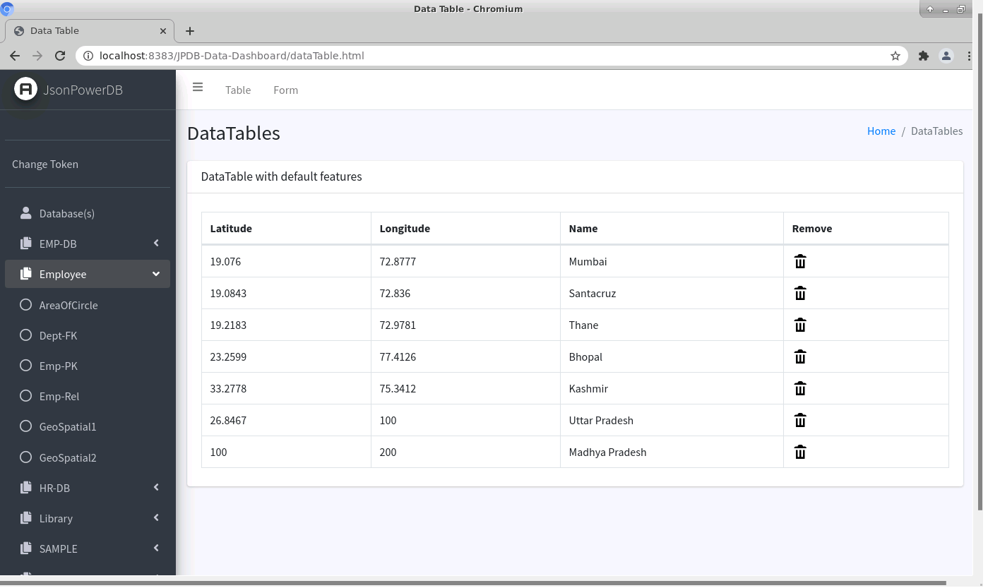
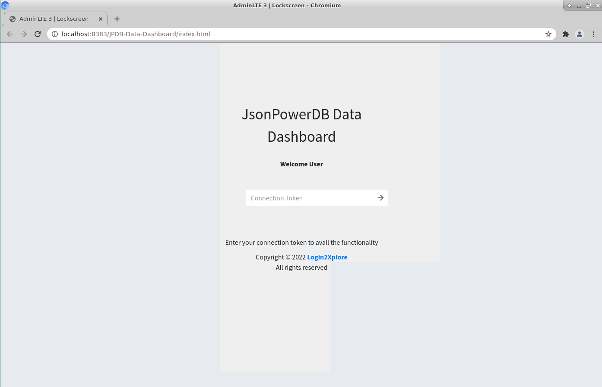
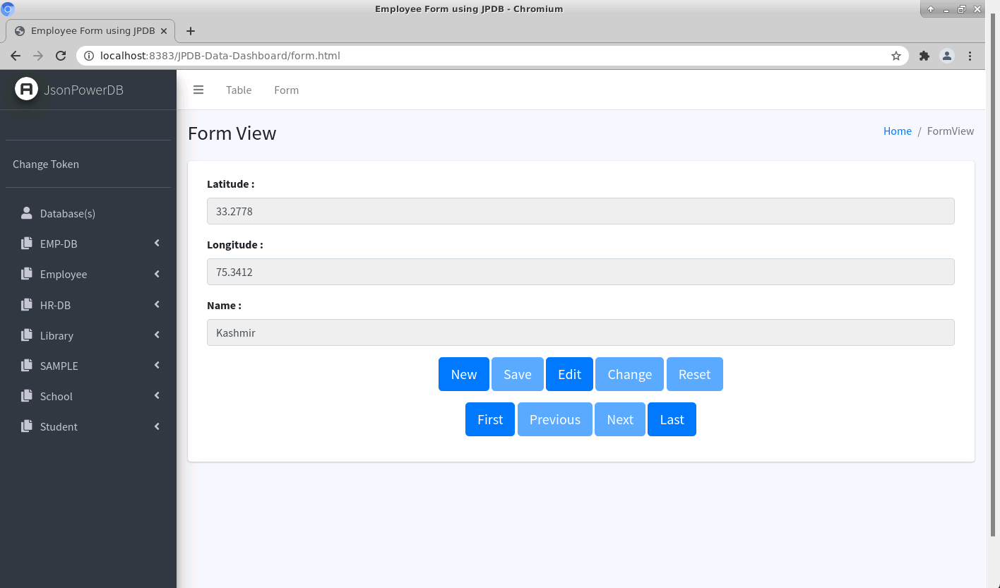
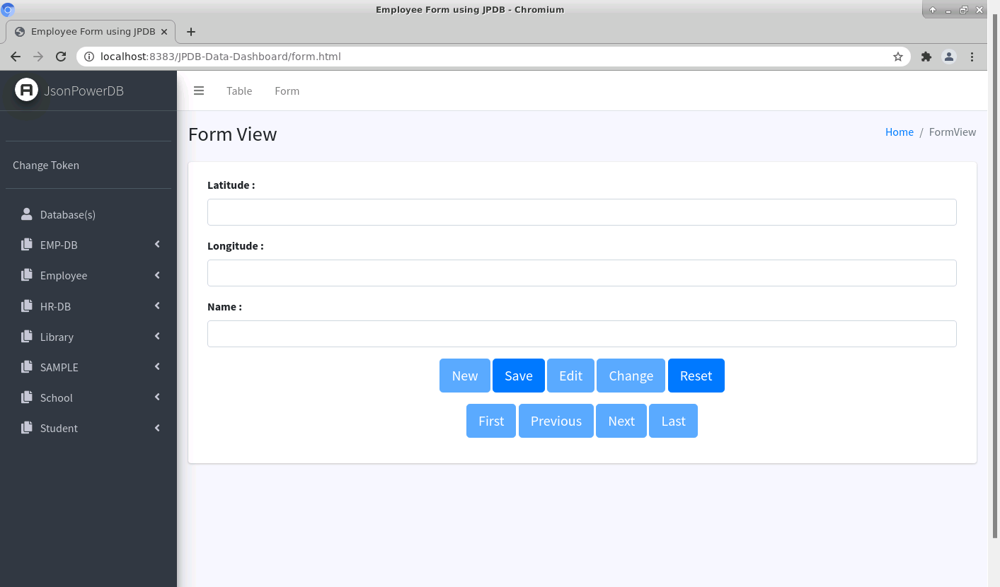

# JPDB-DataDashboard

This repository is having code for JSON Powered Database - Data Dashboard as part of Login2Xplore Multi-Tech Internship  

## About the repository?
   1. Database management using JPDB features
   2. You'll learn JSON power, PowerSQL, JS, JQuery, Bootstap themes

## Files
index.html, dataTable.html, form.html, header.html, footer.html, common-js.js, data.js, form.js, index.js

## Features
   1. Fastest indexing engine PowerIndex, Multimode database for accessing evry database in fastest time
   2. User can Visualize, Delete, Update Database by entering Connection Token in LockScreen
   3. Dynamic display of relation
   4. Each and every data/relation of every Database in finger tips 
   5. Easy updation, addition and EVEN Navigation of data across relation
   6. Easy change of Connection token 
   7. Use of Bootstrap themes to provide best user experience   

## About me
My name is Varun and I'm a android developer with enthusiasm for coding and learning everyday. I am currently in B.Tech 3rd year in Computer Science and gaining experince in Full Stack along with fortifying my DSA.
I am familiar with Java, Kotlin, C++ and ML/AI with with internships and projects in past.

## Important Links
LinkedIn - www.linkedin.com/in/varun-negi-9656691aa

## Sample Images

